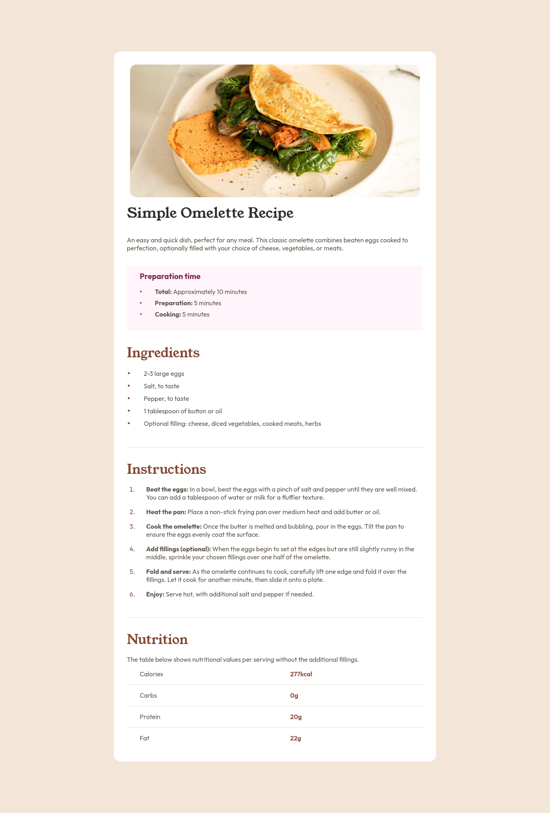

# Frontend Mentor - Recipe page solution

This is a solution to the [Recipe page challenge on Frontend Mentor](https://www.frontendmentor.io/challenges/recipe-page-KiTsR8QQKm). Frontend Mentor challenges help you improve your coding skills by building realistic projects.

## Table of contents

- [Overview](#overview)
  - [The challenge](#the-challenge)
  - [Screenshot](#screenshot)
  - [Links](#links)
- [My process](#my-process)
  - [Built with](#built-with)
  - [What I learned](#what-i-learned)
- [Author](#author)

## Overview

### Screenshot



### Links

- Solution URL: [Add solution URL here](https://your-solution-url.com)
- Live Site URL: [Add live site URL here](https://your-live-site-url.com)

## My process

### Built with

- Semantic HTML5 markup
- Flexbox
- Mobile-first workflow
- [React](https://reactjs.org/) - JS library
- [Sass](https://sass-lang.com) - CSS Preprocessor
- [Vite](https://vite.dev) - Next Generation Frontend Tooling

### What I learned

Still learning on semantic HTML so i can stop using div's everywhere in my code.

Learning to use tags like:

```html
</article>
</section>
</figure>
<!-- Etc... -->
```

Also learned more about media queries.

### Useful resources

- [HTML Elements Reference](https://developer.mozilla.org/en-US/docs/Web/HTML/Element#content_sectioning) - This MDN article helped me understand the basics of HTML semantics.

## Author

- Frontend Mentor - [@Bruno514](https://www.frontendmentor.io/profile/Bruno514)

